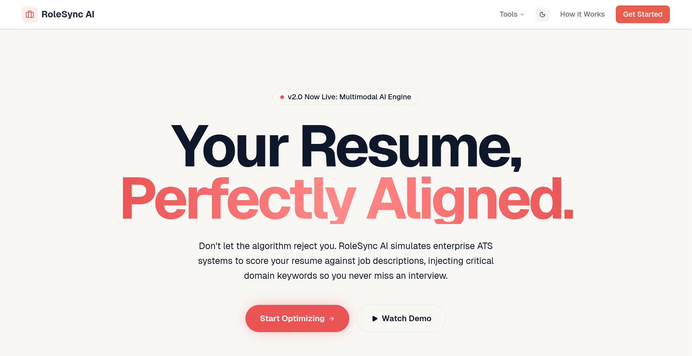

<div align="center">

# 🚀 RoleSync AI

**The Ultimate AI-Powered ATS Resume Optimizer & Cover Letter Engine**

[](https://nextjs.org/)
[](https://react.dev/)
[](https://deepmind.google/technologies/gemini/)
[](https://opensource.org/licenses/MIT)

An advanced edge-stack platform designed to help software engineers and technical candidates bypass rigid Applicant Tracking Systems (ATS) and land more interviews.

<br />



<br />
</div>

RoleSync AI acts as your personal technical recruiter. It intelligently scores your existing resume against target Job Descriptions, identifies critical missing syntax and domain-specific hard skills, and gives you a powerful rich-text editing suite to dynamically inject targeted keywords perfectly.

---

## ✨ Core Architecture & Features

### 🎯 1. Dual-Axis ATS & Domain Scoring
> **Evaluates your profile beyond simple keyword matching.**
* **Intelligent PDF Parsing:** Securely extracts raw text from your uploaded `.pdf` resume entirely in the browser. 
* **Dual-Metrics Engine:** Evaluates your profile on two independent axes—general ATS compatibility constraints and deep Domain Fit against the specific Job Description.
* **Contextual Analysis:** Employs advanced LLM reasoning to extract semantic context, parse your existing skills, and calculate a realistic baseline score before you start editing.

### ✍️ 2. Physical Paper Editing Suite
> **A distraction-free, true-to-life A4 canvas built on TipTap.**
* **Smart Highlight Overlays:** Injected optimizations physically highlight in the document using dynamic DOM mapping, allowing you to instantly visualize where attention is needed.
* **Rich Text Preservation:** Click "Copy Resume" to export your entire document to your clipboard as rich `text/html`, preserving structural formatting for seamless pasting.
* **LaTeX PDF Export:** Generate and copy pristine, compilable LaTeX code directly from your optimized TipTap DOM.

### ✉️ 3. Autonomous Cover Letter Generation
> **Metric-driven cover letters focusing entirely on day-one value.**
* **Zero-Upload Dashboard:** Utilizing global `Zustand` state management, the writer seamlessly inherits the PDF and Job Description already analyzed in your workspace.
* **Technical Recruiter Persona:** Powered by an ultra-strict Prompt Engineering layer to generate punchy, highly relevant first drafts.
* **Built-in Editor:** Adjust the AI's draft right in the browser with a hardened fallback utilizing native `ClipboardItem` APIs for direct email client pasting.

### 🔒 4. Edge-Ready UI & Absolute Privacy
> **You own your data. Nothing is persistently logged.**
* **Privacy First:** All textual extraction and formatting happens inside your browser session.
* **Next-Themes Dark Mode:** Fully synchronized OS system theme switching without layout flashing.
* **Tailwind v4 Typography:** Elegant styling featuring the `@tailwindcss/typography` plugin, complete with dynamic `framer-motion` scanning animations.

---

## 🛠 Tech Stack 

**Frontend:** Next.js 16 (App Router), React 19, Tailwind CSS v4, Framer Motion  
**State Management:** Zustand  
**Editor Core:** TipTap (ProseMirror)  
**AI Integration:** Google Gemini API (`@google/genai`)  
**Utilities:** `lucide-react`, `pdf-parse`, `clsx`, `tailwind-merge`  

---

## ⚙️ Local Development Setup

Get RoleSync AI running locally in under two minutes:

**1. Install Dependencies**
```bash
npm install
```
**2. Configure Environment Variables**
Create a .env.local file in the root directory and add your Google Gemini API Key:

```bash
GEMINI_API_KEY="AIzaSyYourGoogleGeminiApiKeyHere..."
```
**3. Start the Development Server**

```bash
npm run dev
```
**4. Access the App**
Open http://localhost:3000 in your browser.

## 🚀 Deployment
The easiest way to deploy this Next.js app is to use the Vercel Platform. The /api/* routes are highly optimized to handle server-side API generation and LLM streaming gracefully.

## 🤝 Contributing
Contributions, issues, and feature requests are welcome! If you want to improve the ATS parsing logic or add new export formats, feel free to check the issues page.

## 📝 License
This project is MIT licensed.
